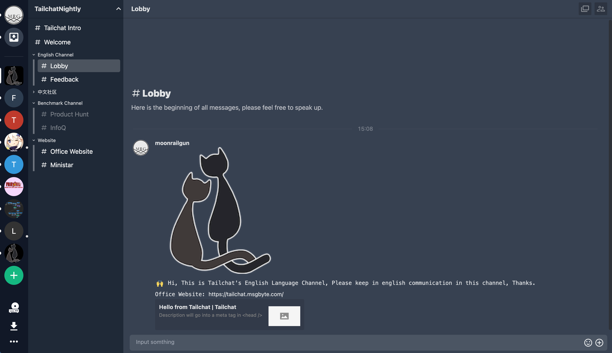
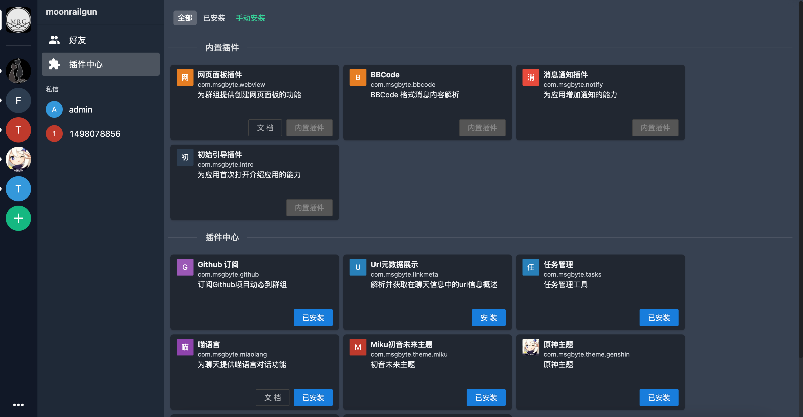
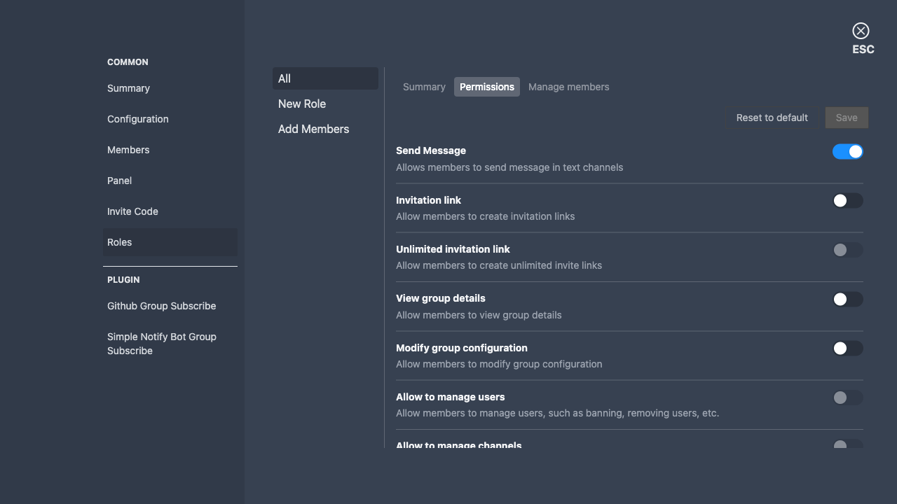

# Tailchat

## 在您自己工作区中的下一代 noIM 应用程序

### 不仅仅是另一个 `Slack`, `Discord`, `Rocket.Chat`....

如果您对`noIM`的概念感兴趣，欢迎阅读我的博客:
- [是时候正式步入noIM的时代了](https://tailchat.msgbyte.com/zh-Hans/blog/2023/03/01/the-era-of-noIM)

官方文档: [https://tailchat.msgbyte.com/](https://tailchat.msgbyte.com/)

**Nightly版** 在线体验: [https://nightly.paw.msgbyte.com/](https://nightly.paw.msgbyte.com/)

> Nightly版 为自动编译版本, 即每次提交代码都会自动编译。
> 不保证数据的可靠性与稳定性

## 动机

目前现有的 IM 应用都仅仅把目光局限在聊天本身，而 IM 天然作为一个多人协作方式，在我看来应当能够承担更多的职责，将外部的应用以 IM 为转发方式形成自己独特的工作流。

因此，我提出了 `noIM` 的观点，意味着 **Not only IM**。而是设计了以 IM 为中心，第三方应用为增强功能，中间以插件系统作为胶水连接层的个人 / 团队高度自定义的应用平台。

为此，将功能进行抽象，并且花费了大量时间设计底层的机制，诞生了 `Tailchat` 这样的一个从底层设计之初就为了拓展而存在的即时通讯应用。通过 `Tailchat` 的插件系统，开发者可以很轻松的将喜欢的应用以一种非常自然的方式作为 `Tailchat` 的一部分。与传统的类似如 `Slack` 的集成方式不同的是，`Tailchat` 的集成更加自由，就仿佛天然就是一个原生的功能一般。

## 特性

- 注重隐私，只有被邀请的成员才能加入群组
- 防止陌生人，只有通过昵称 + 一串随机的数字才能添加好友
- 二维的群组空间，通过频道来分割不同的话题
- 高度自定义的群组空间, 通过分组和拖拽来创建独创的群组空间。同时可以通过更多的插件来增加更多的能力
- 可以严谨，也可以乐趣。通过插件的组合可以创造用于不同场景的 Tailchat。可以是面向娱乐，也可以是面向企业
- 后端微服务架构，已经为大规模部署做好了准备。不用担心用户量大了以后怎么办

## 性能与拓展

`Tailchat` 是一个基于 **React** + **Typescript** 的现代开源 noIM 应用程序

前端微内核架构 + 后端微服务架构，`Tailchat` 已经为集群化部署做好了准备。

前端通过插件机制为应用赋能，对于 `Tailchat` 的二次开发来说非常简单且易用。

**NOTICE: 虽然目前 `Tailchat` 的核心功能处于稳定阶段，但它对于第三方开发者暴露的接口仍在不断完善中，一般来说是向下兼容的，但保留出现 `Break Change` 的可能性**

## 预览

访问官方网站了解更多: [https://tailchat.msgbyte.com/](https://tailchat.msgbyte.com/)

## 交流

如果对 Tailchat 感兴趣，欢迎加入 Tailchat 的种子用户交流群，您的反馈可以帮助 Tailchat 更好的成长

## 快速部署
### 使用 Sealos 部署

### 使用宝塔快速部署

[使用宝塔部署一键部署](https://tailchat.msgbyte.com/zh-Hans/docs/deployment/other-way/bt)

### 社区

[Tailchat Nightly Group](https://nightly.paw.msgbyte.com/invite/8Jfm1dWb)

### 微信

## 项目活动

## 开源协议

[Apache 2.0](./LICENSE)
