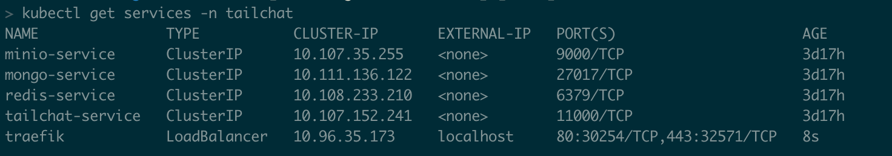

Its doc will tell you how to deploy `Tailchat` in kubeneters.

## One Command 

```bash
kubectl apply -f namespace.yml -f pv.yml -f mongo.yml -f minio.yml -f redis.yml -f tailchat.yml
```

### Delete

if you wanna delete all resource, just delete namespace.

```bash
kubectl delete -f namespace.yml
```

## Setup one by one

### Create Namespace

```bash
kubectl apply -f namespace.yml
```

### Create Persistent Volume

```bash
kubectl apply -f pv.yml
```

### Create Mongodb

```bash
kubectl apply -f mongo.yml
```

### Create Minio

```bash
kubectl apply -f minio.yml
```

### Create Redis

```bash
kubectl apply -f redis.yml
```

### Create Tailchat

```bash
kubectl apply -f tailchat.yml
```

## Check tailchat-service work

#### get services ClusterIP
```bash
kubectl get svc -n tailchat
```

#### create test container in kubernetes

```bash
kubectl run -it --rm test-pod --image=busybox --restart=Never
```

#### request health and checkout `nodeID`, send multi times.
```
wget -q -O - http://<tailchat-cluster-ip>:11000/health
```

## Router and Load Balance

For example, we use traefik.

### Install Traefik provider

```bash
helm repo add traefik https://helm.traefik.io/traefik
helm install traefik traefik/traefik -n tailchat
```

### Apply Ingress Config

```bash
kubectl apply -f ingress.yml
```

### Check Status

```bash
kubectl get services -n tailchat
```

If every is ok, its should be like this:



### Set DNS record

```bash
sudo vim /etc/hosts
```

append this record:

```
127.0.0.1 tailchat.internal.com
```

Now you can open browser and view `http://tailchat.internal.com` to open tailchat in k8s.
