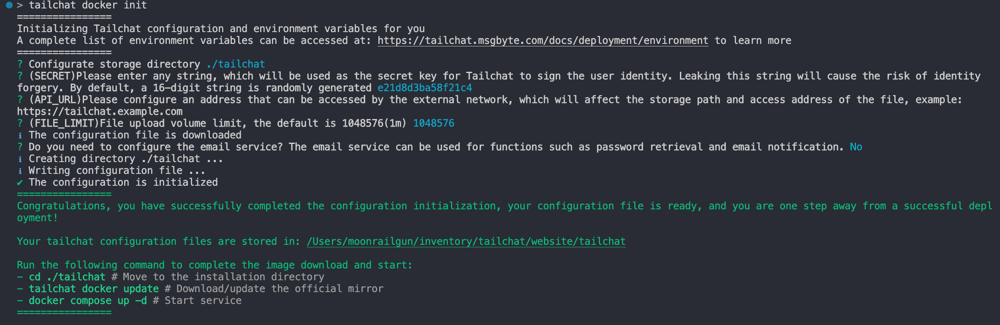

## Recommended configuration

Recommended minimum configuration **1 core 2G**

> If there is only **1 core 1G**? Please refer to my blog: [Linux small resource server experience summary](http://moonrailgun.com/posts/6769ba51/) expand memory space by swapping memory
>
> Memory usage for reference:
> 

## Pre-environment

### Docker / Docker Compose

First you need to make sure you have a `Docker / Docker Compose` environment

The installation method can refer to: [Install the docker environment](./install-docker.md)

## Pull Image

You can pull the compiled image from **public image** or **manually compile from source code**

> Using the compiled image can compile without spending enough computer resources, which is very friendly to servers with small resource configurations. In addition, compared to source code compilation, the code of the public image is more stable.

import Tabs from '@theme/Tabs';
import TabItem from '@theme/TabItem';

<Tabs groupId="build">
  <TabItem value="cli" label="One-command installation using cli" default>

> Use `cli` Please make sure you already have a node environment on your server (node version 16+ is recommended)
> If you don't know about node, you can use `Manually install from public image`

Use the command line tool `tailchat-cli` to pull/update the image with one click:
```bash
npx tailchat-cli docker update
```

  </TabItem>
  <TabItem value="public-image" label="Manually install from public image" default>

Manually install using Docker native commands:
```bash
docker pull moonrailgun/tailchat # Pull the tailchat image from the public image registry
docker tag moonrailgun/tailchat tailchat # Retag the downloaded image to tailchat (consistent with source code compilation, if not changed, it will follow the source code compilation process)
```

:::info
You can view historically supported image versions from [Docker Hub](https://hub.docker.com/r/moonrailgun/tailchat/tags)
:::


  </TabItem>
  <TabItem value="source-code" label="Compile from source">

*This section is for advanced players to get the latest tailchat implementation, please make sure you have enough knowledge of `docker`, `nodejs`, `git`*

#### Compilation environment

- Download from [official website](https://nodejs.org/en/download/)
- Or use [nvm](https://github.com/nvm-sh/nvm)

#### Install pnpm

`pnpm` is a package management tool for `nodejs`, a substitute for `npm`, in order to ensure the same dependency environment as developers, it is strongly recommended that you use pnpm as a follow-up package management tool

```bash
npm install -g pnpm
```

#### Clone Repo

Download the project from remote:

```bash
mkdir msgbyte && cd msgbyte

git clone https://github.com/msgbyte/tailchat.git # Clone the project to local
```

#### Compile project

```bash
cd tailchat && docker compose build
```

*Compilation has certain requirements on server configuration, 2-core 4G compilation takes about 10 minutes, for reference*

After the compilation is complete, you can view the compiled image through `docker images`.

  </TabItem>
</Tabs>


## Startup project

<Tabs groupId="build">
  <TabItem value="cli" label="One-command installation using cli" default>

```bash
npx tailchat-cli docker init
```

Executing this command will ask you some configuration-related questions in an interactive manner (as shown in the figure below), and the configuration file will be automatically generated after filling it out



  </TabItem>

  <TabItem value="public-image" label="Manually install from public image">

> A configuration file needs to be downloaded before starting to tell `docker-compose` how to start the image
> Download configuration files and configure environment variables from the repository:
> - [docker-compose.yml](https://raw.githubusercontent.com/msgbyte/tailchat/master/docker-compose.yml)
> - [docker-compose.env](https://raw.githubusercontent.com/msgbyte/tailchat/master/docker-compose.env)

```bash
mkdir tailchat && cd tailchat
wget https://raw.githubusercontent.com/msgbyte/tailchat/master/docker-compose.yml
wget https://raw.githubusercontent.com/msgbyte/tailchat/master/docker-compose.env
```

Need to modify the configuration before starting

Modify the configuration of the `docker-compose.env` file, the following fields are recommended to be modified:

- `API_URL` is an externally accessible url address, used for file service access, it can be a domain name or an ip **If the sent picture cannot be displayed normally, this variable is not set**
- `SECRET` server-side encryption key, used to generate Token. The default is `tailchat`

  </TabItem>
  <TabItem value="source-code" label="Compile from source">

Need to modify the configuration before starting

Modify the configuration of the `docker-compose.env` file, the following fields are recommended to be modified:

- `API_URL` is an externally accessible url address, used for file service access, it can be a domain name or an ip **If the sent picture cannot be displayed normally, this variable is not set**
- `SECRET` server-side encryption key, used to generate Token. The default is `tailchat`


  </TabItem>
</Tabs>


After completing the configuration, use `docker-compose` to start the `Tailchat` application with one click:

```bash
# Make sure the configuration files (docker-compose.yml and docker-compose.env) are in the current directory
# Execute the following command to start with one key
docker compose up -d
```

Visit: `http://<server ip>:11000` to open tailchat.

Note that some cloud services may need to manually open firewall ports.

*Some environment variables are provided in the `docker-compose.env` file for configuration.*

The `docker-compose.yml` configuration of `tailchat` provides the following configuration by default:

- `mongodb`: Persistent Database
- `redis`: KV database and message transport service
- `minio`: Distributed file service

The persistent files (database, file storage) are managed uniformly through `docker volume`:

```
docker volume ls | grep "tailchat-server"
```

:::info
Complete environment variables can be queried [Environment Variables](./environment.md)
:::

## More deployment related documents

- [Build https gateway (optional)](./https-gateway.md)
- [Deployment admin platform (optional)](./admin.md)
