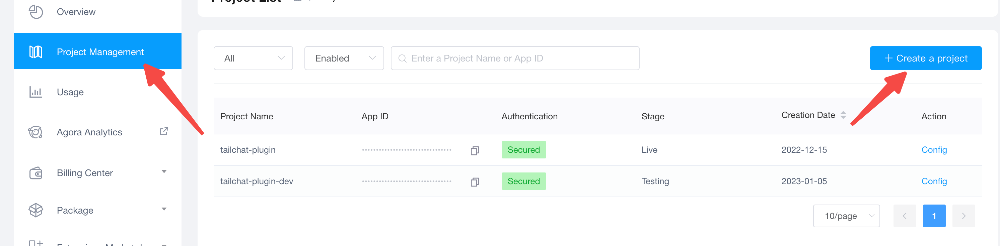
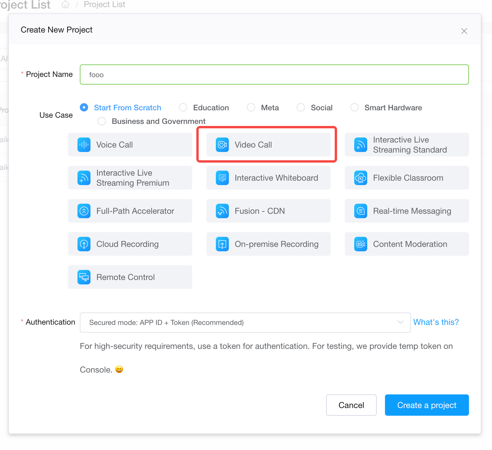
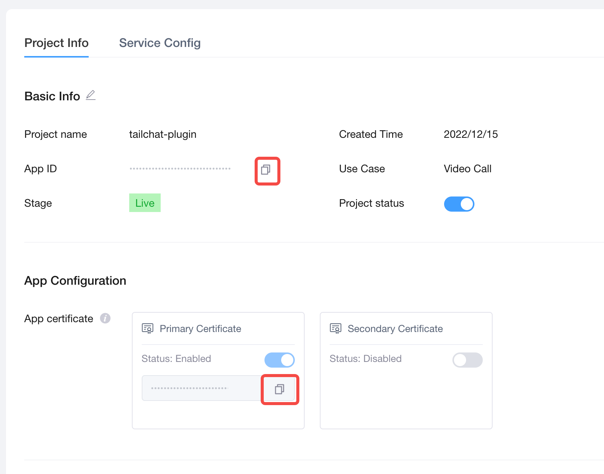
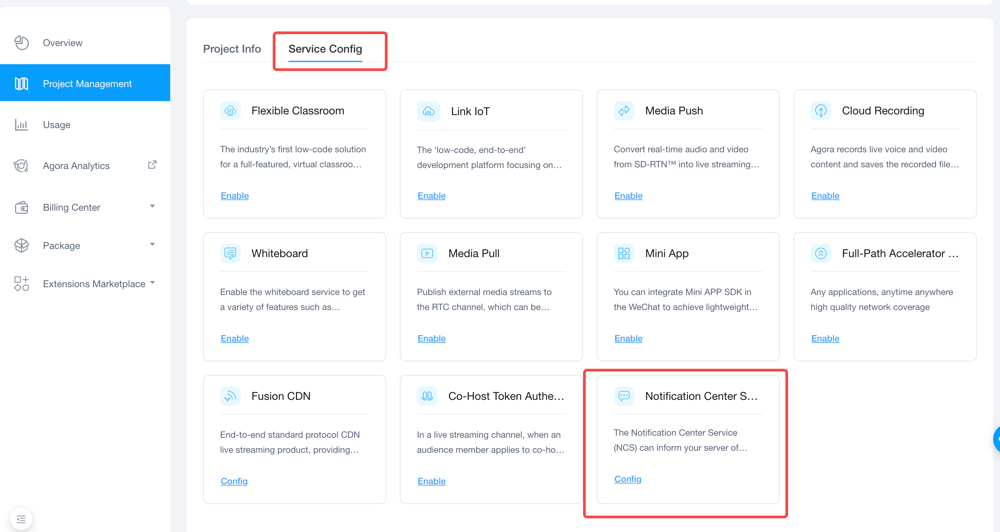
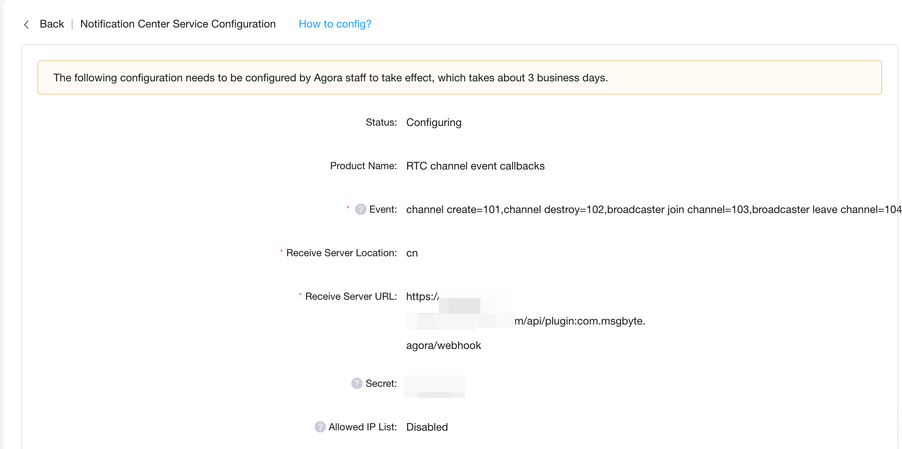
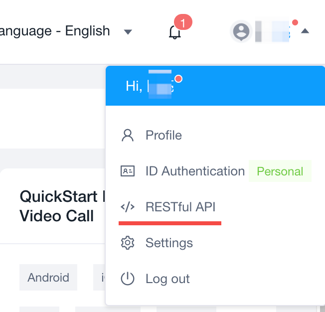
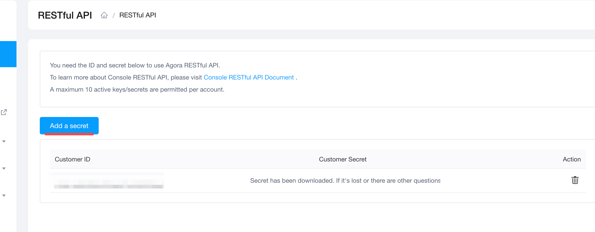

:::info
声网插件需要确保您的 `tailchat` 镜像版本在 1.4.0+
:::

## 在声网平台申请项目

Tailchat 声网集成是依赖声网服务实现的音视频通话功能，因此在使用前需要在声网平台上注册。

声网官方: [https://www.agora.io/](https://www.agora.io/)

### 获取配置参数

注册完毕后/登录后会自动跳转到控制台。在控制台中可以进行项目配置

如果没有创建项目则需要先创建项目。如下图所示

建议使用安全模式以避免被其他人盗用。

接下来我们需要获取一些配置项用于配置`Tailchat`的声网插件。

在项目配置中我们可以获取 `appid` 和`app cert`。这个两个是我们之后要用到的环境变量 `AGORA_APP_ID` 和 `AGORA_APP_CERT`

### 申请服务状态回调

为了使通话状态能够同步给`Tailchat`, 需要在声网中申请服务端回调。

在项目配置中，我们需要在`服务配置` 中启用`消息通知服务`

需要订阅以下事件:

- channel create=101
- channel destroy=102
- broadcaster join channel=103
- broadcaster leave channel=104

接收服务器 URL 一般为: `https://<YOUR SERVER DOMAIN>/api/plugin:com.msgbyte.agora/webhook`, 其中`<YOUR SERVER DOMAIN>` 换成你的 `Tailchat` 域名。

配置完成后你会看到如下提示。等待声网工作人员确认完毕后即可生效。

### 获取客户凭证

另外我们还需要在右上角的 `RESTful API` 处获得客户的权限, 

操作如图所示:

这样我们就拿到了另外两个环境变量: `AGORA_CUSTOMER_KEY` 和 `AGORA_CUSTOMER_SECRET`。

我们初步的准备工作就完成了

## 安装插件

目前声网插件的服务端插件已经被默认安装，您无需做任何事情。但是为了正常使用需要配置环境变量

### 配置环境变量

配置环境变量请见 [环境变量](../deployment/environment.md)

声网插件需要环境变量如下:

- `AGORA_APP_ID`: 声网项目应用id
- `AGORA_APP_CERT`: 声网项目证书
- `AGORA_CUSTOMER_KEY`: 声网客户id
- `AGORA_CUSTOMER_SECRET`: 声网客户秘钥

这些环境变量都可以在上面的教程中获取。
