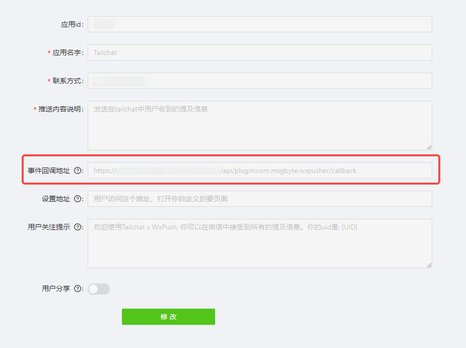

`com.msgbyte.wxpusher`

## 使用文档

- 在插件中心找到`wxpusher`插件，安装
- 在 `左下角...` -> `更多` -> `wxpusher`
- 使用微信扫码绑定账号
- 之后 **@你** 的消息都会自动在微信中推送

## 部署文档

### 在wxpusher平台注册账号

在应用设置中设置回调地址, 如下:



`https://<your backend domain>/api/plugin:com.msgbyte.wxpusher/callback`

### 获取appToken

在 [https://wxpusher.zjiecode.com/admin/main/app/appToken](https://wxpusher.zjiecode.com/admin/main/app/appToken) 中获取 appToken

### 配置Tailchat环境变量

将上一步获取到的appToken写入环境变量中，如:
```
WXPUSHER_APP_TOKEN=xxxxxxxxxxxxxx
```

启动后生效, 你可以访问 `https://<your backend domain>/api/plugin:com.msgbyte.wxpusher/available`来检查服务可用性
