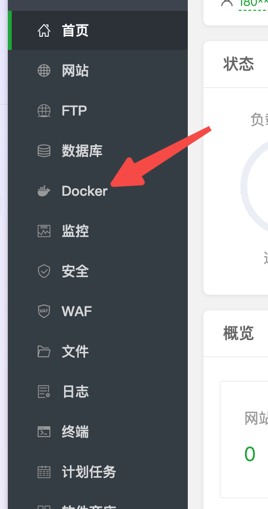
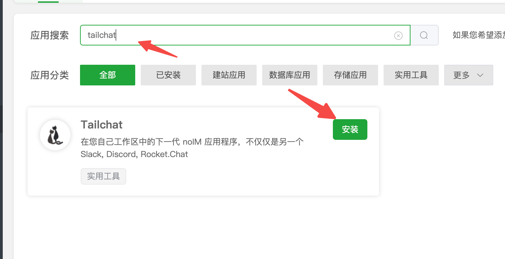
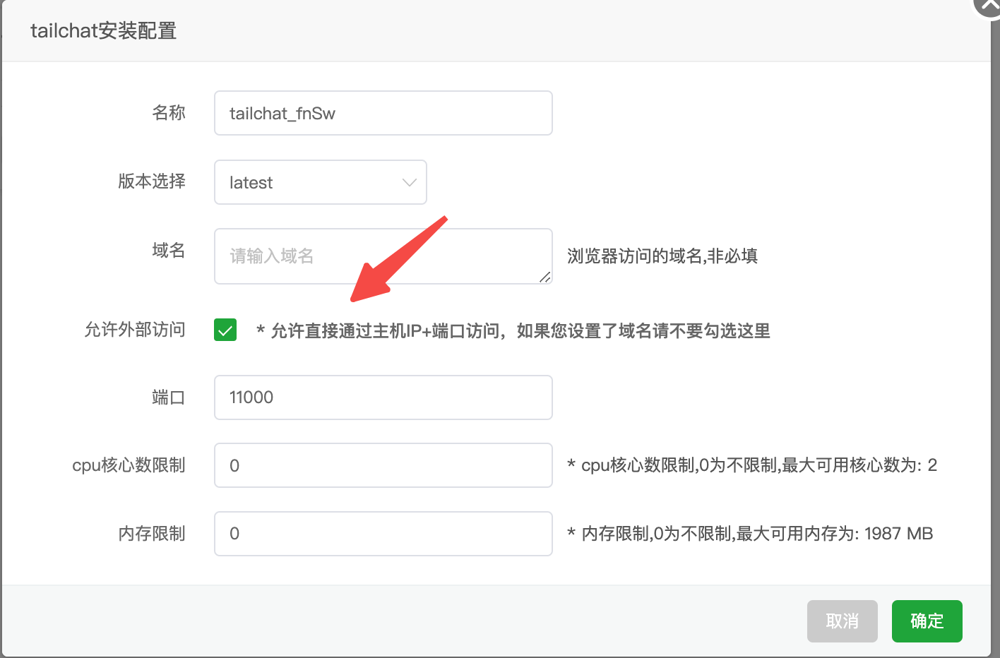
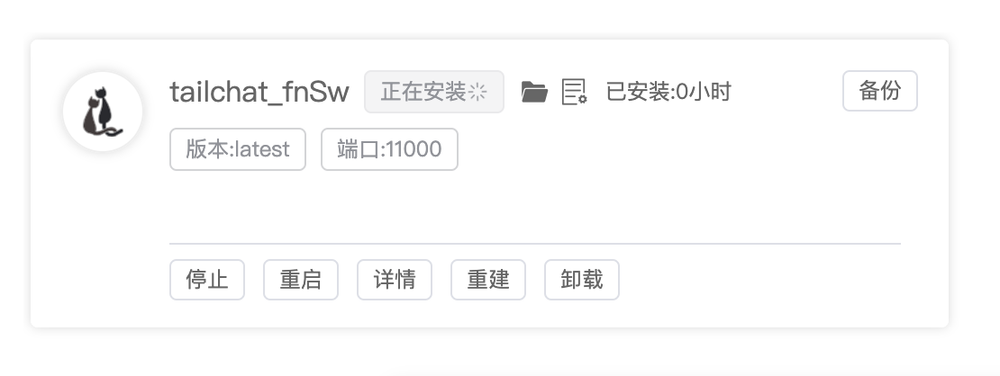
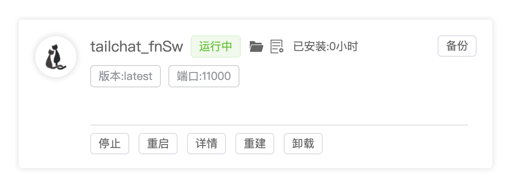

:::info
Tailchat 已上架宝塔应用商店，你可以在应用商店中一键安装Tailchat

宝塔服务器面板，一键全能部署及管理: [https://www.bt.cn](https://www.bt.cn/u/P0shD8)
:::

## 安装宝塔

如果您已经有宝塔服务器，直接登录宝塔面板，跳过本节内容即可。

点击以上链接跳转到宝塔官网，查看如何在你的服务器安装宝塔

## 在应用商店安装

登录到宝塔面板，在侧边栏点击 `docker` 菜单

在应用商店中搜索 Tailchat，点击安装按钮

如果使用的是ip，请勾选`允许外部访问`。端口默认为11000

点击确定，需要等待一段时间，等待时间主要取决于服务器网络

等待一段时间后，显示完成后在浏览器打开 `http://<your-ip>:11000`

